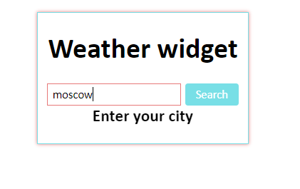
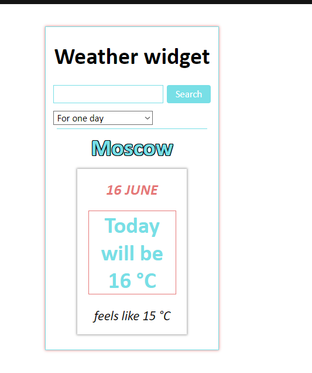
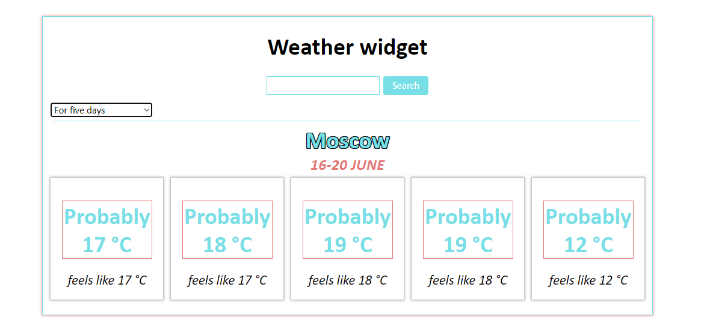

# Weather widget

## Available Scripts

In the project directory, you can should open console and write:

(for download node_modules folder)

### `npm i`

or

### `yarn install`

then can start app

### `npm start`

Open [http://localhost:3000](http://localhost:3000) to view it in the browser.

## Home page

At this page you can type any existing city in field and then click on button or push 'Enter' button

## Weather

So when you typed city and submit  you can see weather for one day and 'select' menu where you can switch type of weather you want to display

When you was switch type you will see weather for 5 days

